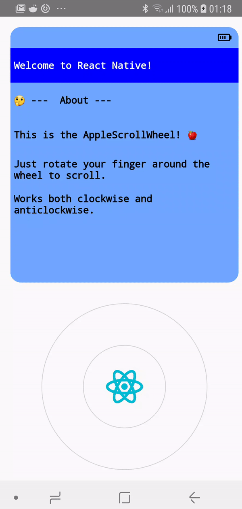

# react-native-apple-scroll-wheel
The iconic scroll wheel that debuted with the original iPod. Now for React Native.

<p align="center">
  
</p>

## 🚀 Getting Started

Using [npm]():

```sh
npm install --save react-native-apple-scroll-wheel
```

Using [yarn]():

```sh
yarn add react-native-apple-scroll-wheel
```

Then you can easily import to your project using:

```javascript
import AppleScrollWheel from 'react-native-apple-scroll-wheel';
```

## ✍️ Example

In the snippet below, we outline the basic interface to the [`AppleScrollWheel`]('./RNAppleScrollWheel/components/AppleScrollWheel/components/AppleScrollWheel'):

```javascript
<AppleScrollWheel
  value={this.state.value}
  minValue={-720}
  increment={1}
  maxValue={720}
  onChangeValue={value => this.setState({ value })}
/>
```

For a complete working example, please check out the included [example code]('./RNAppleScrollWheel/components/AppleScrollWheel').

## 📌 Props

-----
Prop                  | Type     | Default                   | Required |
--------------------- | -------- | ------------------------- | -------- |
radius|number|120|No|
innerRadius|number|60|No|
increment|number|10|No|
minValue|number|360 * -2|No|
maxValue|number|360 * 2|No|
value|number|0|No|
onChangeValue|func|v => null|No|
outerCircleStyle|shape[object Object]|styles.outerCircleStyle|No|
innerCircleStyle|shape[object Object]|styles.innerCircleStyle|No|
InnerComponent|func|React.Fragment|No|

## ✌️ License
[MIT](https://opensource.org/licenses/MIT)
